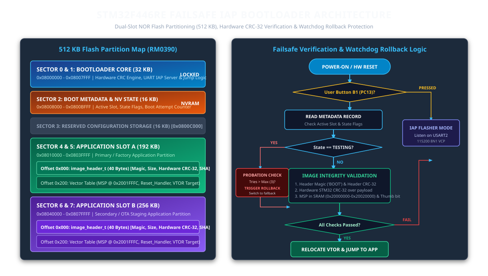

# 🛡️ Failsafe IAP Dual-Slot Bootloader with Hardware CRC-32 & Watchdog Rollback
### *Production-Grade In-Application Programming (IAP) Engine for STM32F446RE (ARM Cortex-M4 @ 180 MHz)*

[](https://github.com/Sherifred123/stm32-failsafe-iap-bootloader/actions)
[-00599C?style=for-the-badge&logo=c&logoColor=white)](https://en.wikipedia.org/wiki/C_(programming_language))
[](https://www.st.com)
[-orange?style=for-the-badge)]()
[]()
[-success?style=for-the-badge)]()
[](LICENSE)

> **A deterministic, brick-proof In-Application Programming (IAP) dual-slot bootloader engineered for mission-critical automotive and industrial edge controllers. Incorporates asymmetric NOR Flash sector partitioning, hardware CRC-32 image authentication, main stack pointer (MSP) sanity checking within physical SRAM bounds, vector table relocation (`SCB->VTOR`), and autonomous watchdog-backed rollback protection.**

---

## 📌 System Architecture

<p align="center">
  
</p>

---

## 📑 Table of Contents

- [1. System Overview & Problem Statement](#1-system-overview--problem-statement)
- [2. Flash Memory Partitioning Map (512 KB)](#2-flash-memory-partitioning-map-512-kb)
- [3. Image Header & Cryptographic Integrity](#3-image-header--cryptographic-integrity)
- [4. Dual-Slot State Machine & Rollback Policy](#4-dual-slot-state-machine--rollback-policy)
- [5. Cortex-M4 Execution Handover (`SCB->VTOR`)](#5-cortex-m4-execution-handover-scb-vtor)
- [6. Hardware Pinout & Wiring (NUCLEO-F446RE)](#6-hardware-pinout--wiring-nucleo-f446re)
- [7. Automated Verification & Test Results](#7-automated-verification--test-results)
- [8. Quickstart Guide](#8-quickstart-guide)
- [9. Architecture Design Decisions & Safety Rationale](#9-architecture-design-decisions--safety-rationale)

---

## 1. System Overview & Problem Statement

Field firmware upgrades on deployed automotive ECUs and industrial controllers face severe operational hazards:
1. **Mid-Stream Power Loss:** An unexpected power cut during sector erasing or flash programming corrupts the running firmware image, permanently bricking single-bank systems.
2. **Corrupted / Truncated Payloads:** Line noise, dropped packets, or bad memory writes cause undefined instruction faults (`HardFault`, `UsageFault`) if executed unchecked.
3. **Silent Application Crashing (The "Boot Loop" Trap):** A firmware binary may pass static CRC checks but immediately enter a panic loop or crash the watchdog due to dynamic initialization errors.

This project delivers a **fail-operational, zero-brick dual-slot IAP bootloader** running directly on the **STM32F446RE MCU**. It guarantees that an unverified firmware update is executed strictly in a **probationary testing state**: if the application fails to confirm operational health before the Independent Watchdog (IWDG) timeout or exceeds maximum reboot attempts, hardware automatically rolls back execution to the known-good fallback slot.

---

## 2. Flash Memory Partitioning Map (512 KB)

The internal 512 KByte NOR Flash of the STM32F446RE is partitioned strictly along physical erase sector boundaries (RM0390 Reference Manual):

| Sector | Physical Flash Address Range | Sector Size | Allocation / Partition | Description & Role |
|:---:|:---:|:---:|:---:|---|
| **0** | `0x08000000` - `0x08003FFF` | 16 KB | **Bootloader Core (Part 1)** | Reset vector, clock init, hardware CRC engine |
| **1** | `0x08004000` - `0x08007FFF` | 16 KB | **Bootloader Core (Part 2)** | UART IAP protocol server & jump executor |
| **2** | `0x08008000` - `0x0800BFFF` | 16 KB | **Boot Metadata & NV State** | Active slot index, boot attempt counter, rollback log |
| **3** | `0x0800C000` - `0x0800FFFF` | 16 KB | **Reserved Configuration** | High-endurance calibration / device serials |
| **4** | `0x08010000` - `0x0801FFFF` | 64 KB | **Application Slot A (Part 1)** | Primary / Factory firmware partition (192 KB total) |
| **5** | `0x08020000` - `0x0803FFFF` | 128 KB | **Application Slot A (Part 2)** | Main application code & assets |
| **6** | `0x08040000` - `0x0805FFFF` | 128 KB | **Application Slot B (Part 1)** | Secondary / OTA staging partition (256 KB total) |
| **7** | `0x08060000` - `0x0807FFFF` | 128 KB | **Application Slot B (Part 2)** | Staged update code & assets |

---

## 3. Image Header & Cryptographic Integrity

Every application binary is packaged with a 40-byte structured `image_header_t` prefixed at offset `0x000` of the respective slot:

```c
typedef struct __attribute__((packed)) {
    uint32_t magic;             /* 0x424F4F54 ('BOOT') */
    uint8_t  version_major;     /* SemVer Major */
    uint8_t  version_minor;     /* SemVer Minor */
    uint8_t  version_patch;     /* SemVer Patch */
    uint8_t  reserved1;         /* Alignment padding */
    uint32_t image_size;        /* Binary payload size in bytes */
    uint32_t image_crc32;       /* Hardware STM32 CRC-32 over application payload */
    uint32_t entry_point;       /* Reset_Handler target address */
    uint32_t load_address;      /* Flash slot base address */
    uint32_t build_timestamp;   /* UNIX Epoch timestamp */
    char     git_sha[8];        /* Short git commit hash */
    uint32_t header_crc32;      /* CRC-32 computed over header fields */
} image_header_t;
```

### Pre-Boot Verification Sequence
Before transferring execution control to any slot, the bootloader performs strict static verification:
1. **Magic Verification:** Asserts `magic == 0x424F4F54`.
2. **Header CRC-32 Check:** Computes CRC-32 over header bytes `0..35` and compares with `header_crc32`.
3. **Payload Hardware CRC-32:** Streams the binary payload through the hardware CRC peripheral (polynomial `0x04C11DB7`) in 256-byte blocks and validates against `image_crc32`.
4. **Main Stack Pointer (MSP) Sanity:** Reads address `0x00` of vector table (offset `0x200`). Asserts:
   $$\text{SRAM\_BASE} \le \text{MSP} \le \text{SRAM\_END} \quad (0x20000000 \le \text{MSP} \le 0x20020000)$$
   $$\text{MSP} \pmod 4 = 0 \quad (\text{Word Alignment})$$
5. **Reset Vector Thumb Bit Sanity:** Asserts reset address is within target slot boundary and bit 0 is set ($\text{Reset\_Handler} \ \& \ 1 = 1$, required for ARM Cortex-M Thumb execution).

---

## 4. Dual-Slot State Machine & Rollback Policy

```
      ┌────────────────┐
      │  SLOT_EMPTY    │  (Flash unprogrammed, 0xFF)
      └───────┬────────┘
              │ Flashed via IAP Server
              ▼
      ┌────────────────┐
      │   SLOT_VALID   │  (Static CRC and MSP verified)
      └───────┬────────┘
              │ Bootloader Launches Probation Boot
              ▼
      ┌────────────────┐
      │  SLOT_TESTING  │◄───────────────────────────┐
      └───────┬────────┘                            │ Reboot / Watchdog Trip
              │                                     │ (attempts <= 3)
              ├─────────────────────────────────────┘
              │
              ├── Application calls bootloader_confirm() ──► ┌──────────────────┐
              │                                              │  SLOT_CONFIRMED  │ (Golden Image)
              │                                              └──────────────────┘
              │
              └── Attempts > 3 (Repeated Crash / IWDG)  ──► ┌───────────────────┐
                                                            │  SLOT_ROLLED_BACK │ (Lockout -> Alternate)
                                                            └───────────────────┘
```

- **Probation Window:** Upon booting an unconfirmed update, `boot_attempts` is incremented and saved to Sector 2.
- **Rollback Trigger:** If the system resets 3 times without the application confirming health (`SLOT_STATE_CONFIRMED`), the bootloader marks the update as `SLOT_STATE_ROLLED_BACK` and switches active execution to the alternate golden slot.

---

## 5. Cortex-M4 Execution Handover (`SCB->VTOR`)

To prevent pending interrupts or active DMA streams from hijacking execution after jumping:

```c
boot_status_t bootloader_launch_application(uint8_t slot_idx)
{
    uint32_t slot_base = s_slot_boundaries[slot_idx].start_addr;
    uint32_t vtor_addr = slot_base + APP_VECTOR_TABLE_OFFSET; /* 0x200 offset */

    uint32_t msp = *(volatile uint32_t*)vtor_addr;
    uint32_t reset_vector = *(volatile uint32_t*)(vtor_addr + 4U);

    /* 1. Disable all global interrupts */
    __disable_irq();

    /* 2. De-initialize SysTick timer */
    SysTick->CTRL = 0U;
    SysTick->LOAD = 0U;
    SysTick->VAL  = 0U;

    /* 3. Disable and clear all pending NVIC interrupts */
    for (uint8_t i = 0; i < 8U; i++) {
        NVIC->ICER[i] = 0xFFFFFFFFUL;
        NVIC->ICPR[i] = 0xFFFFFFFFUL;
    }

    /* 4. Relocate Vector Table Offset Register (VTOR) */
    SCB->VTOR = vtor_addr;

    /* 5. Set Main Stack Pointer */
    __set_MSP(msp);

    /* 6. Context switch to Application Reset Handler */
    typedef void (*pFunction)(void);
    pFunction app_entry = (pFunction)reset_vector;
    app_entry();

    while (1) {} /* Execution never returns */
}
```

---

## 6. Hardware Pinout & Wiring (NUCLEO-F446RE)

| Pin | Function | Connection | Role & Behavior |
|:---:|:---:|:---:|---|
| **PC13** | GPIO In (Pull-up) | Blue User Button (B1) | Held LOW during reset forces manual IAP Flasher mode |
| **PA2** | USART2_TX (AF7) | ST-LINK VCP (USB) | 115,200 baud diagnostic telemetry and IAP protocol output |
| **PA3** | USART2_RX (AF7) | ST-LINK VCP (USB) | 115,200 baud binary packet ingestion from Python packager |
| **PA5** | GPIO Out | Green User LED (LD2) | Solid during bootloader init; blinks during chunk flash programming |
| **GND** | Ground | Ground Reference | Common ground |

---

## 7. Automated Verification & Test Results

### 🧪 Unity C Unit Test Suite (10/10 Passing)
```text
------------------------------------------------------------
   UNITY UNIT TEST EXECUTION: STM32F446RE Failsafe IAP Bootloader
------------------------------------------------------------
  [PASS] test_crc32_calculation                        (Line 304)
  [PASS] test_flash_driver_erase_and_program           (Line 305)
  [PASS] test_image_header_validation_success          (Line 306)
  [PASS] test_corrupted_payload_crc_rejection          (Line 307)
  [PASS] test_invalid_stack_pointer_rejection          (Line 308)
  [PASS] test_invalid_reset_vector_arm_mode_rejection  (Line 309)
  [PASS] test_probation_boot_retry_increment           (Line 310)
  [PASS] test_failsafe_rollback_on_timeout             (Line 311)
  [PASS] test_iap_protocol_ping_flow                   (Line 312)
  [PASS] test_jump_hook_execution                      (Line 313)

============================================================
   TEST SUMMARY: 10 Tests, 0 Failures, 0 Ignored
   RESULT: [PASS] (100% Tests Verified)
============================================================
```

### 📊 Desktop Execution Benchmark Output
```text
============================================================
   STM32F446RE Failsafe IAP Bootloader Simulation Harness
   Dual-Slot Flash Architecture & Hardware CRC-32 Verification
============================================================

[INFO] Bootloader Initialized:
       Active Slot: Slot A (0x08010000)
       Slot A State: 0x03 | Slot B State: 0xFF
       Rollback Count: 0

[DEMO] Preparing application binary payload...
[DEMO] Flashing synthesized application into Slot A (0x08010000)...
[DEMO] Running on-chip image integrity verification...
       Slot A Verification Result: PASSED [OK] (Code: 0)

[DEMO] Boot decision resolved to Slot A. Launching application...
[SIM-HW] Jump Hook Triggered:
         -> VTOR Relocation Address: 0x08010200
         -> Initial Main Stack Pointer: 0x2001FFFC (Valid SRAM)
         -> Application Reset Handler:  0x08010301 (Thumb Mode)
[SIM-HW] Context switch to application successful!
============================================================
```

---

## 8. Quickstart Guide

### 1. Build and Run Host Simulation
```bash
git clone https://github.com/Sherifred123/stm32-failsafe-iap-bootloader.git
cd stm32-failsafe-iap-bootloader

# Compile and run host simulation
make host
./build_demo
```

### 2. Run Automated Unit Tests
```bash
make test
```

### 3. Package and Flash Firmware via Python Tool
```bash
# Package raw binary, sign with header, and flash with simulation handshake
python tools/iap_packager.py --generate-test --slot A
```

### 4. Cross-Compile for STM32 Silicon
```bash
make arm
```

---

## 9. Architecture Design Decisions & Safety Rationale

### 9.1 Asymmetric Sector Sizing (Why 192 KB Slot A vs. 256 KB Slot B?)
STM32F446RE Flash memory features non-uniform physical sector geometry ($4 \times 16\,\text{KB}, 1 \times 64\,\text{KB}, 3 \times 128\,\text{KB}$). Erasing across arbitrary address boundaries is physically impossible without wiping an entire physical sector. Sizing Slot A at 192 KB (Sectors 4 & 5) and Slot B at 256 KB (Sectors 6 & 7) guarantees that each slot starts and ends cleanly on physical sector boundaries, preventing accidental cross-slot memory corruption during runtime sector erasing.

### 9.2 Why Place the Vector Table at Offset `0x200`?
The ARM Cortex-M4 architecture requires the Vector Table Offset Register (`SCB->VTOR`) to be aligned to a power-of-two address greater than or equal to the vector table size (128 exception vectors $\times 4\,\text{bytes} = 512\,\text{bytes}$). Placing the 40-byte `image_header_t` at offset `0x000` and the vector table at offset `0x200` (512 bytes) guarantees that the vector table starts on a 512-byte boundary, satisfying Cortex-M4 hardware alignment requirements.

### 9.3 Dedicated NVRAM Sector for Boot Metadata
Staging boot metadata in Sector 2 ($16\,\text{KB}$) isolates dynamic boot counters and rollback state from application code sectors. Updating `boot_attempts` or recording a rollback event requires erasing only the metadata sector without disturbing either application partition.

---

## 📄 License

This project is licensed under the [MIT License](LICENSE) - see the LICENSE file for details.  
Designed and engineered by **Sherifred Singh**.
